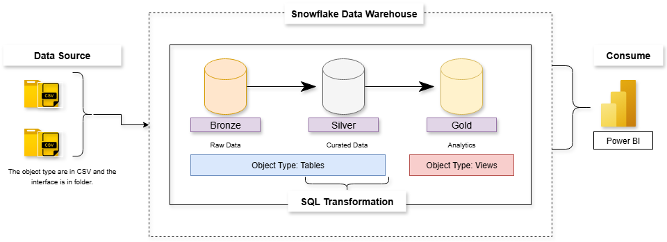

# ❄️ Snowflake Data Pipeline and Analytics Project

This project is designed as a **portfolio project** that highlights **industry best practices** in **data engineering** and **analytics** using the **Medallion Architecture (Bronze → Silver → Gold)** approach.
The goal is to build a **modern data warehousing solution** using **Snowflake**, consolidating data from multiple sources, cleaning and transforming it for analytical use, and visualising business insights with **Power BI**.
It demonstrates how scalable, well-structured data pipelines can support accurate reporting, business intelligence, and strategic decision-making within a modern cloud data ecosystem.

---

## 🧠 Project Requirements

### **🏗️ Building a Data Warehouse using Snowflake**

**🎯 Objective:**
Develop a **modern data warehouse** using Snowflake to consolidate sales data, enabling analytical reporting and informed decision-making.

**📋 Specifications:**

* **Data Sources:** Import data from two systems — **ERP** and **CRM** — provided as **CSV files**.
* **Data Quality:** Cleanse and resolve data quality issues before analysis.
* **Integration:** Combine both sources into a unified, analytics-ready data model by creating a **single view** for reporting.
* **Scope:** Focus on the **latest dataset** only.
* **Documentation:** Provide clear, structured documentation of the data model to support both technical and business stakeholders.

---

## 📊 BI: Analytics & Reporting

**🎯 Objective:**
Deliver insights into key business areas through interactive analytics and visualisations.

**💡 Focus Areas:**

* Customer Behaviour
* Product Performance
* Sales Trends

These insights empower stakeholders with key **business metrics**, driving **data-informed strategic decisions**.

---

## 🔁 ETL Process

### **Extraction**

* **Type:** Full extraction
* **Method:** Pull extraction from CSV files into Snowflake (Bronze layer)

### **Load**

* **Type:** Batch processing
* **Method:** Full load using **stored procedures** with **truncate and insert** logic for clean refreshes

### **Transformation**

* **Scope:** Full transformation using **SQL scripts** within Snowflake
* **Layers:**

  * **Bronze:** Raw and ingested data
  * **Silver:** Curated and cleaned data
  * **Gold:** Business-ready, analytics-focused datasets

---

## 🧩 Data Architecture

### **🔹 Bronze Layer — Raw & Ingested Data**

* Stores unprocessed data as received from CSV sources (ERP & CRM).
* Loaded using Snowflake’s `COPY INTO` or Snowpipe.
* Serves as the immutable foundation for transformations.

### **🔸 Silver Layer — Curated & Clean Data**

* Cleanses and standardises raw data.
* Handles data type casting, deduplication, and consistency checks.
* Outputs data suitable for integration and analysis.

### **🔶 Gold Layer — Analytics & Business Data**

* Combines Silver data into analytical views.
* Delivers KPIs and aggregated insights for business reporting.
* Connected to **Power BI** for visualization and interactive dashboards.

📊 **Data Flow:**
CSV Files → Snowflake (Bronze → Silver → Gold) → Power BI



---

## ⚙️ Tools & Technologies

| Tool / Platform                | Purpose                                                         |
| ------------------------------ | --------------------------------------------------------------- |
| **Snowflake**                  | Cloud data warehouse for storage, transformation, and analytics |
| **SQL**                        | Data transformation and modelling across Medallion layers        |
| **Power BI**                   | Business Intelligence and data visualization                    |
| **CSV Files**                  | Source data from ERP and CRM systems                            |

---

## 📁 Project Folder Structure

```
📦 Snowflake-Data-Pipeline-and-Analytics-Project
│
├── 📂 datasets/             # Source CSV files (ERP & CRM)
├── 📂 docs/                 # Documentation of data model & process
├── 📂 scripts/              # SQL scripts for ETL and transformations
├── 📂 powerbi_dashboard/    # Power BI reports & visuals
└── README.md                # Project overview and guide
```

---

## 📄 License

This project is licensed under the **MIT License** — you are free to use, modify, and distribute it with proper attribution.

---

## 👤 Author

**Adeola Adedayo**
Data Engineer
🔗 [LinkedIn](https://www.linkedin.com/in/adedayo-adeola/) • [GitHub](https://github.com/AnalystCam/) • [Email](gbolahanadeola23@outlook.com)

---
